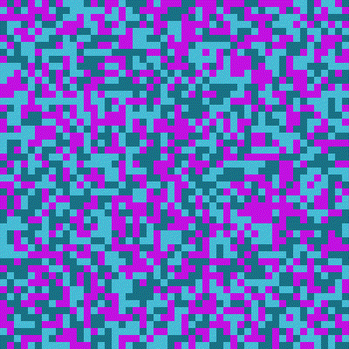

# gif-generator

This is a program to generate gif images given a path with images.

* Download the latest release of [gif-generator.exe](https://github.com/marcoagbarreto/gif-generator/releases/download/v0.1.1/gif-generator.exe)

## Example

1. Go to the path where the ``gif-generator.exe`` or ``gif-generator.py`` is stored.
2. Open ``cmd`` and go to the ``gif-generator.exe`` folder.
3. Use these commands to run ``gif-generator.exe``.
4. ``C:\path_to_app\>gif-generator.exe -n <file_name> -p <path> -f <fps> -q <quality>``
5. Profit.

* ``C:\gif-generator>gif-generator.exe -n pixelspatterns -p "C:\Users\user\Downloads\images" -f 5 -q 75``
* ``C:\gif-generator>python gif-generator.py -n pixelspatterns -p "C:\Users\user\Downloads\images" -f 5 -q 75``

## Code Usage

clone the repository (no installation required, source files are sufficient):
        
    https://github.com/marcoagbarreto/gif-generator.git

dependencies:

    import sys
    import getopt
    import os
    from PIL import Image

or [download and extract the zip](https://github.com/marcoagbarreto/gif-generator/archive/main.zip) into your project folder.

## Known limitations: 
* If you want the GIF to follow a specific sequence, name the images numerically: 1.png, 2.png, 3.png...
* Supported image formats: ``".png", ".jpg", ".jpeg"``

